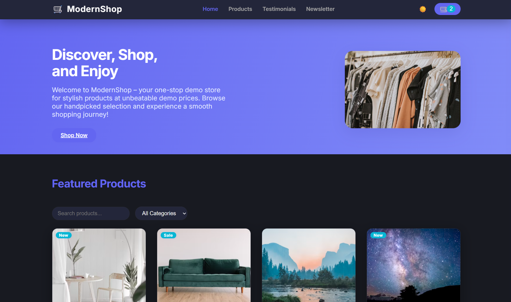
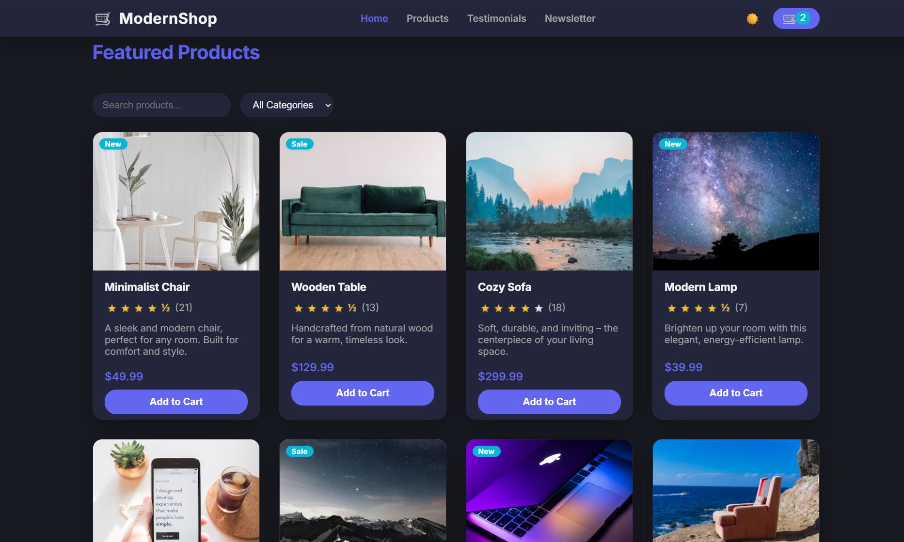
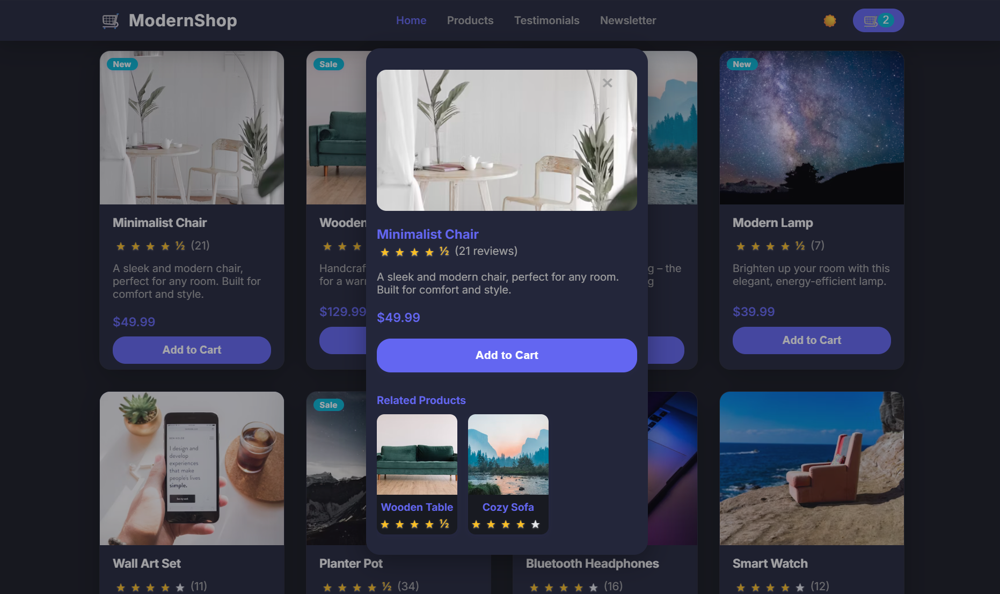
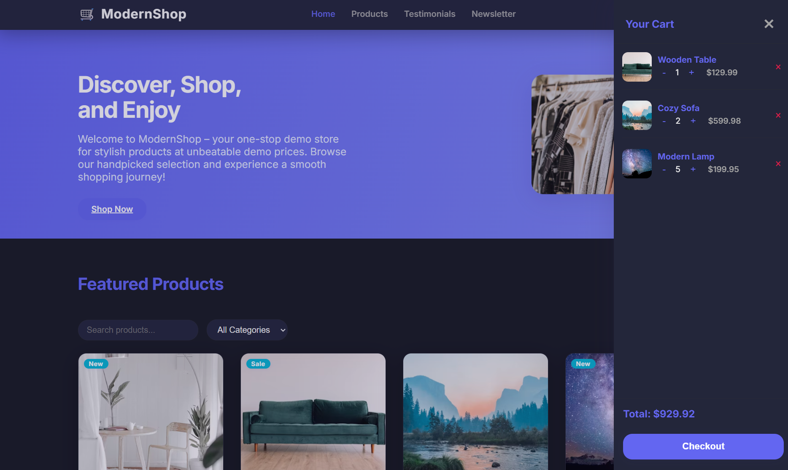
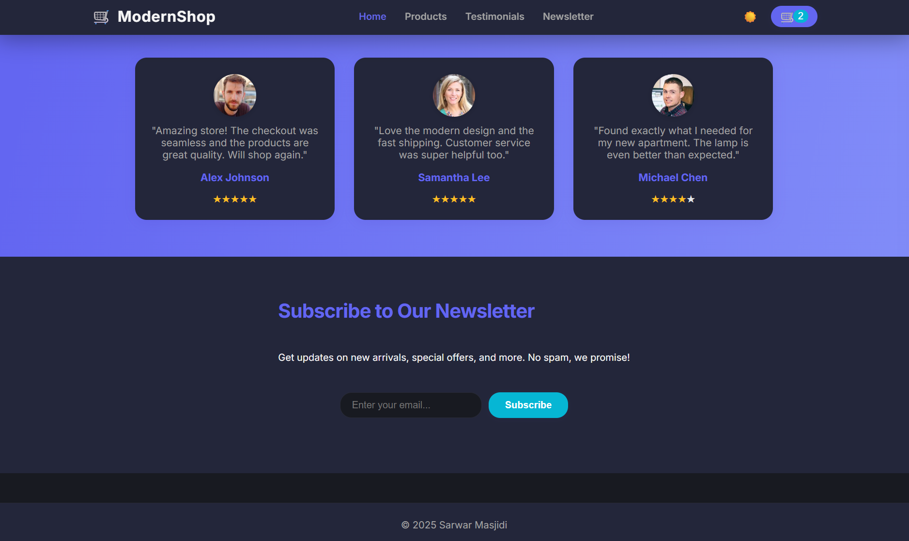

# ModernShop_SarwarMasjidi_Prroject

This is a fully responsive and visually modern eCommerce website built using **HTML**, **CSS**, and **JavaScript**. The design is clean, elegant, and mobile-friendly, making it perfect for showcasing products or creating a small online store.

## ✨ Features
- Modern homepage and product layout
- Interactive elements (e.g., add to cart, hover effects)
- Responsive design for all devices
- Custom CSS animations and transitions
- Organized folder structure and clean code

## 🚀 Tech Stack
- HTML5
- CSS3
- JavaScript (Vanilla)

## 📁 Live Demo
[View Website](https://modernshop-sarwar-project.netlify.app/) 

## 📸 Screenshots

## 📌 Usage
Feel free to fork or clone this project and customize it for your own shop or demo site.

